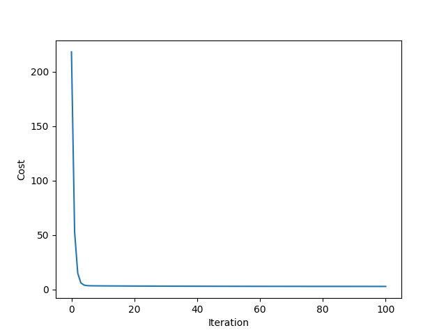
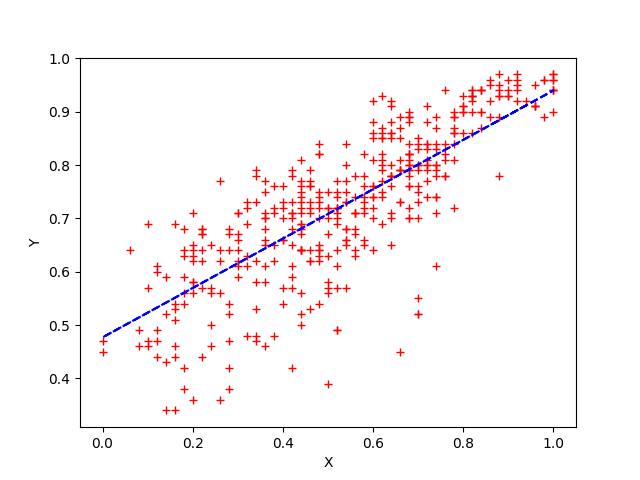

# linear regression

Linear Regression using Gradient Descent.

## Requirements

```bash
sudo apt install python3 python3-pip
sudo pip3 install matplotlib
```

## Usage

```bash
python3 test.py
```

There are 2 datasets to test with :

- `ADDMISSIONS_DATASET`
  - use `learning_rate = 0.4`

- `CRIME_RATE_DATASET`
  - use `learning_rate = 0.03`

example (output) :

```text
INITIAL WEIGHTS :

|   0.00 |
|   0.00 |

Iteration : 100, Cost: 2.915365784568024

FITTED WEIGHTS :

|   0.48 |
|   0.46 |

R2 SCORE : 0.6408381059532751
```



